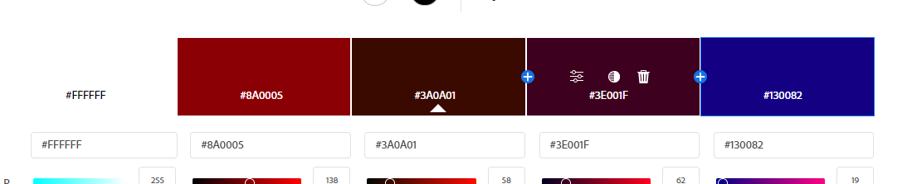

Gabriel Curet http://a1-gabrielcuret.glitch.me

This project shows a little bit about myself and my experiences with web development, listing out the ones I'm familiar with and the ones I'm not. For this project, I had to do a bit of research about making an animation, this meant looking into addEventListener() to see if a button was clicked and using .style.fontSize property to adjust the size of the selected element. With some help from StackOverflow I was able to create an animation that once you click on the button will enlarge the text and once you click it again it goes back to normal size. 

Technical Achievements
Styled page with CSS: Added rules for the body, h1, h2, p, ul li, button, and button: hover. 
Simple JavaScript animation: Created a button once pressed it animates the text to get bigger and then smaller once clicked again. 
Extra HTML tag: Used a footer, a link, an image, a button, and multiple unorder lists.
 
Design Achievements
Used the PT Serif from Google Fonts: I used PT Serif as the font for the primary copy text on my site.
Created a color pallet on color Adobe: I used color Adobe to create a color pallet which is used for the selection of colors on the website.

First I added to the HTML all relevant information according to the specifications on the assigment.
After that I changed the server.js to support script.js and css file where I could coustumize the website more easily. 
Added a footer tag on the HTML and the wpi logo inside of it. 
Added a google font
Added a link.
added multible unorder lists
Created my color palet.
In the CSS I made a new rule for the backgroun the toggle button and when hoovered for the animation also one for the fotter the image and text aling. 

