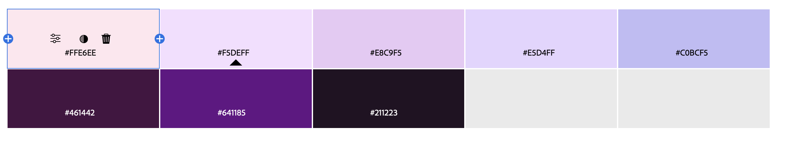

Assignment 1 - Hello World: Basic Deployment w/ Git, GitHub, Glitch
===

Assignment details
---
Aaron Zhang - https://a1-azzhang3.glitch.me

This project gives a brief introduction about myself, including my background, and other information regarding my experiences in computer science (the tools I used, courses I've taken, and work experience).

Technical Achievements
---

1. Style Rules
- I used more than 5 different style rules across a number of selectors.
- I used styles on classes (background, course, tools, work, main_img, circle-outline, circle-outline2) and selectors (p, h1, h2, body, img, footer)
- Position Style Rules (display, justify-content, grid-template-columns, align-items, padding, margin, rotate): These style rules all helped position the content exactly where I wanted it. 
- Appearance Style Rules (clip-path, background-color, color, border-color, border-radius, font-family): These style rules all helped with the appearance of the content, by setting colors of texts and backgrounds. Additionally, I used clip-path and border-radius to help shape the content into circles.
- Size Style Rules (font-size, font-weight, height, width, max-width): These style rules all helped me adjust the size of the objects including shapes, images, and texts. 
- I had a lot of style rules in my code, so I thought separating it out like this would help understand how some of them functioned. 

2. JavaScript Animation
- I added an animation where if you hover your mouse pointer over my picture, the rings around the picture would start spinning.
- An issue I had was making it so the rings would stay in place when you release it and then continue from where it left off once you hover over it again. Right now, it just restarts from the beginning once you hover over it again.

3. HTML tags
- link: I used link to help link my html to my css, as well as adding the Nerko One font to my HTML. 
- style: I used style to help display the font I used from google. 
- img: I used img to put a image of myself.
- div: I used div to help position and organize different sections of the body. 
- ol: I used the ordered list to list the courses I have taken at WPI, in the order I took it. 
- footer: I used the footer to add some additional information including the year this website was made and by whom (azzhang3).
- script: I used script to link the JavaScript to the html. 

Design
---
1. Color Palette:
- I used all the colors from this palette. The lighter colors are used in the background, and the darker colors are used on the text and the rings around the picture.

2. Font:
- I used Nerko One for the title of the website (Information about Aaron Zhang)

