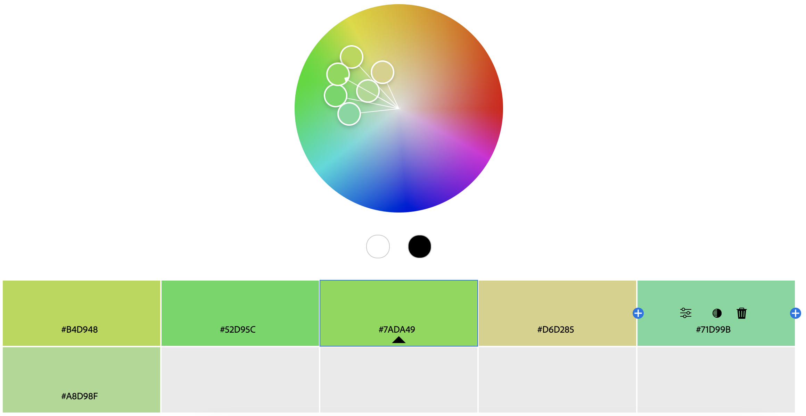

Kay Siegall (They/Them)

https://a1-krsiegall.glitch.me
===

Project to show basic competency with html, css, and js

Achievements
---

*Technical*
1. **Style Rules:** Created style rules for h1, h2, p, body, ul, and two different divs. h1, h2, and p were basically just for text formatting, but body also specifies background color, and the divs have borders and their own background colors.
2. **JS Element:** The box divs that store my experience can be dragged around using your mouse.
3. **Additional HTML tags:** I additionally used a link, multiple lists, and many divs for different purposes.
4. **Other:** I pulled some old code I had to create a firefly element that flies around the screen. I included many of these near the bottomn of index.html, and these are purely CSS.

*Design*
1. **Color Palette:** Color palette was borrowed from my personal website and reused:

2. **Font:** Used Montserrat font.
