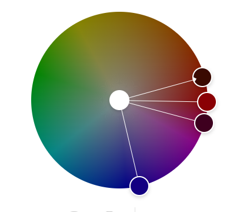

Assignment 1 - Hello World: Basic Deployment w/ Git, GitHub, Glitch
===

Kayla Lem
http://a1-kay-lem.glitch.me

This project shows ...

## Technical Achievements

- Created a.css file, in order to edit the background color by making it a gradient, formatting a table, adding dividers, adding images, changing color of text, and aligning everything to the center of the page.

- added links to the CSS sheet, images, tables, headers, and footers 

### Design Achievements
- **Used the Roboto Font from Google Fonts**: I used Roboto as the font for the primary copy text in my site.

- Added a Google Font (Matemasie) for the top text
- Added a color palette  
